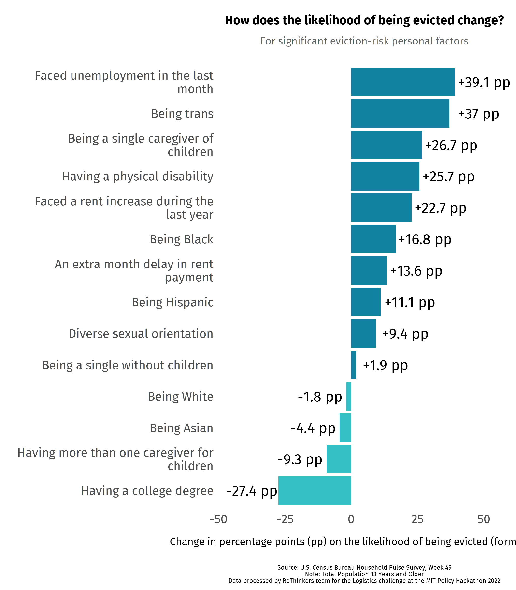

    
<!-- \usepackage{fancyhdr} -->
<!-- \pagestyle{fancy} -->
<!-- % center of header -->
<!-- \fancyhead[CO,CE]{Your Document Header} -->
<!-- % center of footer -->
<!-- \fancyfoot[CO,CE]{And this is a fancy footer} -->
<!-- % page number on the left of even pages and right of odd pages -->
<!-- \fancyfoot[LE,RO]{\thepage} -->

```{r setup, include=FALSE}
knitr::opts_chunk$set(echo = TRUE)
require(pacman)
p_load(readr, readxl, tidyverse, dplyr, lubridate, openxlsx, janitor, lme4, knitr)

load("df_clean.RData")

```

Being at risk of eviction is a result of several factors. Recognizing the multicasual nature of this social phenomenon, the _ReThinkers_ team designed a quantitative strategy sensitive to both personal-level factors and county-level factors. 

## Datasets 
- Household Pulse Survey (HSP)
- Census data 
- State eviction laws data sets
- Treasury Emergency Rental Assistance (ERA) Dashboard

## Software 
For estimation of econometric modeling we used the following R-Packages:  

- A grammar of data manipulation (\texttt{dplyr} package[@wickham2015dplyr])
- Elegant graphics for data analysis (\texttt{ggplot2} package[@wickham2011ggplot2])
- Analysis and Presentation of Social Scientific Data (\texttt{jtools} package[@long2017package])
- Econometric modeling (\texttt{stats} package[@R-core])
- GAM and Generalized Ridge Regression for R (\texttt{mgcv} package[@wood2012mgcv])

### \texttt{dplyr}
A grammar of data manipulation, \texttt{dplyr}  package, was built by Hadley Wickham. It "provides a consistent set of verbs that help you solve the most common data manipulation challenges".[@wickham2015dplyr] We used \texttt{dplyr} for the initial data processing in order to have clean data suited for the modeling and visualization processes.
<!--  https://dplyr.tidyverse.org/ -->  


### \texttt{ggplot2}
All the visualizations in this report were built using the \texttt{ggplot2} package, created by Hadley Wickham, which is "a system for declaratively creating graphics, based on The Grammar of Graphics" by Leland Wilkinson[@wilkinson2012grammar].

<!-- https://ggplot2.tidyverse.org/ -->  


### \texttt{epitools}
We also took advantage of the \texttt{epitools} package, a set of "basic tools for applied epidemiolgy".[@aragon2012epitools] We used the package to estimate the observed variation of homicide data. 

<!--  https://www.rdocumentation.org/packages/epitools/versions/0.09 -->  

### \texttt{lme4}
All the models from the fist section were buil using the \texttt{lme4} package, created by Ben Bolker. It is designed to fit Linear, Generalized Linear, And Nonlinear Mixed models, providing different functions such as \texttt{lmer()}, \texttt{glmer()}, and \texttt{nlmer()}.[@bates2007lme4] Since we are modeling counts and rates (assuming a Poisson distribuiton for the dependent variable), we used the \texttt{glmer()} function, fitted for Generalized Linear Mixed Models (GLMM).  

<!-- https://www.rdocumentation.org/packages/lme4/versions/1.1-26/topics/lme4-package -->  

### \texttt{jtools}
Jacob A. Long wrote the \texttt{jtools} package as a set of tools "for the purpose of more efficiently understanding and sharing the results of regression analyses.[@long2017package] For our analysis, we used the \texttt{summ()} function to present the results of the \texttt{glmer()} models. The  \texttt{summ()} command "prints output for a regression model in a fashin similar to \texttt{summary}, but formatted differently with more options", which include including data description, goodness of fit measurements, as well as fixed and random effects coefficients.[@long2017package] 

### \texttt{merTools}
The \texttt{merTools} package, Tools for Analyzing Mixed Effect Regression Models, "provides methods for extracting results from mixed-effect model objects fit with the \texttt{lme4} package" and "allows construction of prediction intervals efficiently from large scales linear and generalized linear mixed-effects models".[@knowles2016mertools] From this package, we used the \texttt{predictInterval} command, wich provides the confidence intervals for the random effects coefficients using bootstrapping techniques. 

<!-- https://www.rdocumentation.org/packages/merTools/versions/0.5.2 --> 

### \texttt{mgcv}
Finally, we use the \texttt{mgcv} package, Mixed GAM Computation Vehicle with Automatic Smoothness Estimation,  by Simon Wood to perform final modeling with the smoothnes transformations.[@wood2012mgcv] In particular, we used the \texttt{gamm()} function for modeling Generalized Additive Mixed Models with the smoothness (achived through the use of splines) applied to the *time* variable.

<!-- https://www.rdocumentation.org/packages/mgcv/versions/1.8-33 -->  


## Probit model for personal-level factors 

The following snipet code shows the probit model specification. 
```{r pressure, echo=TRUE, results = "hide"}
# Model 
m1 <- glm(
  eviction_likelihood ~ age + female + white + black + asian +
    hispanic + non_het + trans + single + kids + college + 
    unemployment_month + military + disability_phys + disability_mental + 
    rent_assistance + rent_increase + rent_delay_months + (single*kids), 
    family = binomial(link = "probit"), 
    weights = df_clean$pweight, 
    data = df_clean, 
    # na.rm = T
    )
```
Here's the table of coefficient. 


```{r table, echo=FALSE}
summary(m1)
```

And a more intuitive way of understanding significant results. 


```{r figures, echo = FALSE}


```
