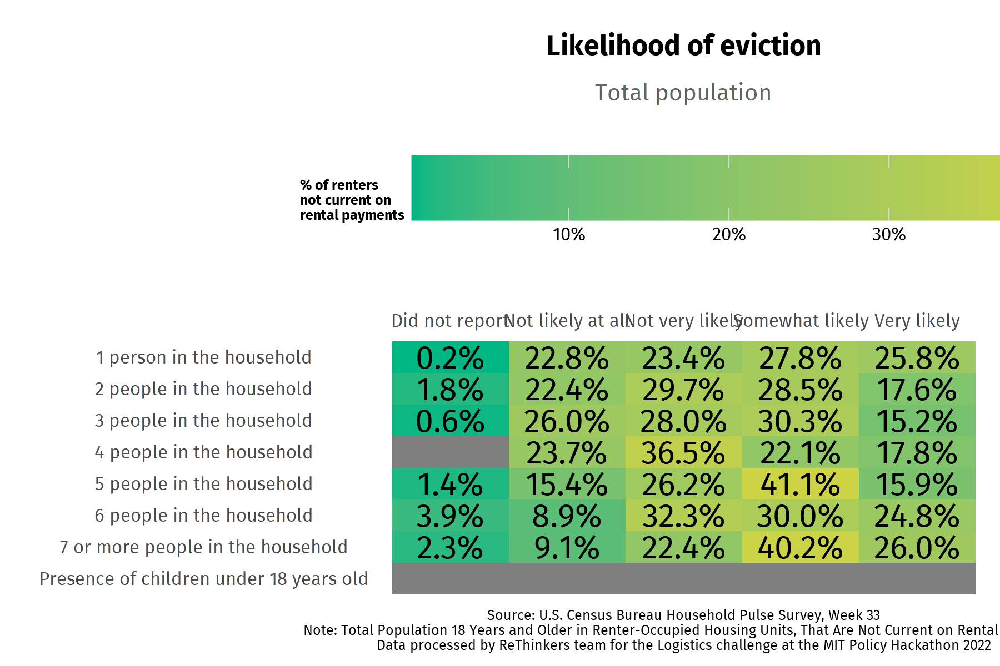
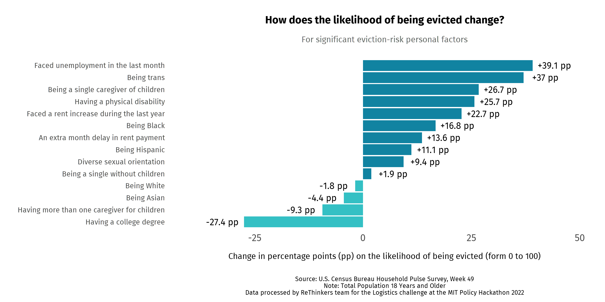

# ReThinking Emergency Rental Allocation 🫱🏽‍🫲🏼

**ReThinkers:** Regina Isabel Medina Rosales, Sanhitha Cherukupally, Tasaduq Soomro and, Carlos Enrique Huapaya. 👩🏽‍💻👨🏽‍💻

This repository stores all the R and Python scripts used for wrangling and modeling data for the ReThinkers. You can read the final Policy Memo with which our team won the 2022 MIT Policy Hackathon Logistics Challenge . The repository also includes additional figures that were not included in the final Policy Memo. 

## Executive Summary 📝
To improve the allocation of Emergency Rental Allocation Program (ERA) funds, we designed a two-component policy strategy. The first component analyzes the need for rental assistance at the county levels and assesses the likelihood of eviction by taking into account an individual’s sociodemographic background; the second component facilitates efficient funds usage with human resources training and information campaigns led by local NGOs & governments and a web application that cuts red tape.

## Datasets 🗃️
- Household Pulse Survey (HSP)
- Census data
- State eviction laws data sets
- Treasury Emergency Rental Assistance (ERA) Dashboard

## Software 🖥️

#### For estimation of econometric modeling we used the following R-Packages:
- A grammar of data manipulation (dplyr package[@wickham2015dplyr])
- Elegant graphics for data analysis (ggplot2 package[@wickham2011ggplot2])
- Analysis and Presentation of Social Scientific Data (jtools package[@long2017package])
- Econometric modeling (stats package[@R-core])
- GAM and Generalized Ridge Regression for R (mgcv package[@wood2012mgcv])

#### And the following Python-Packages
- An easy package to access to the U.S. Census Bureau’s API (censusdata)
- Nn interactive, open-source, and browser-based graphing library (plotly)

## Results Spotlight 🗞️

